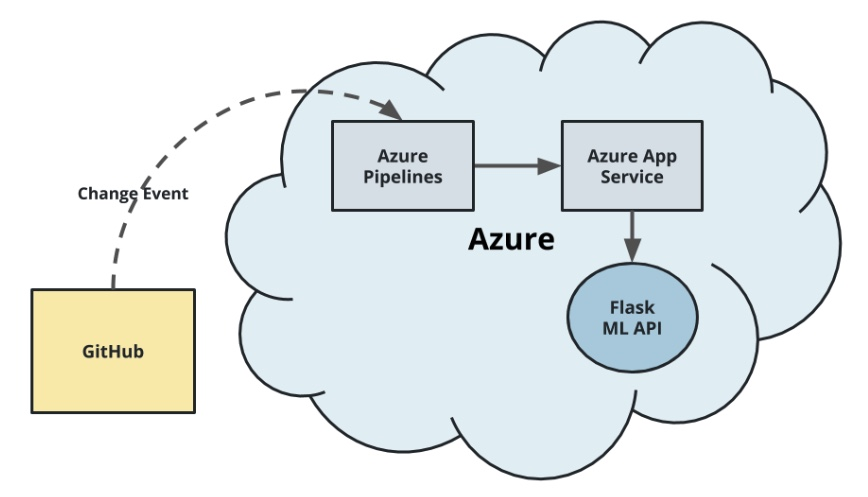
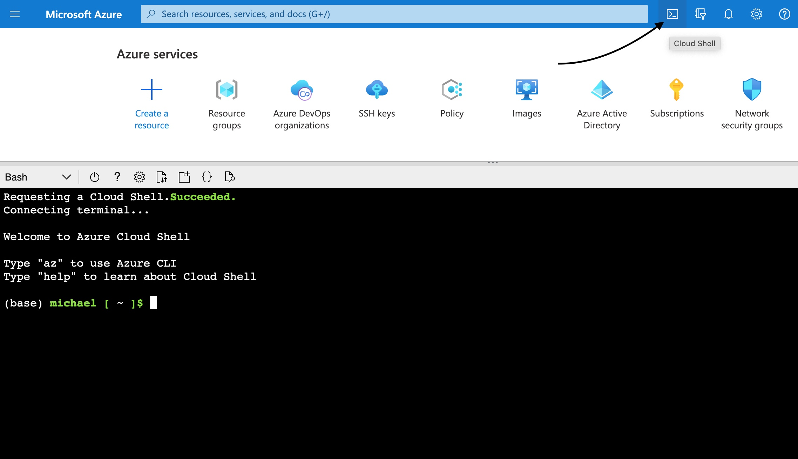
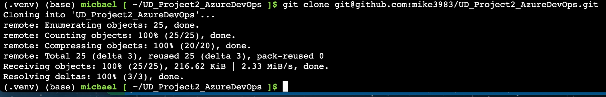
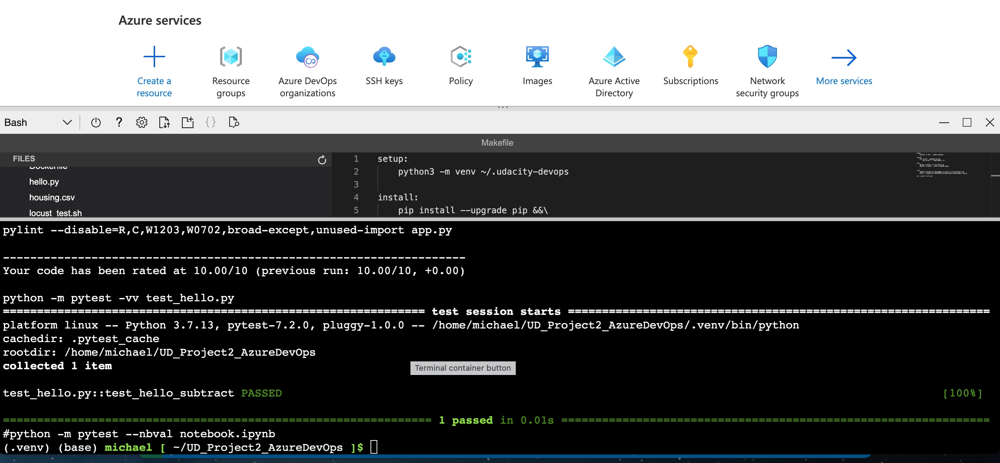
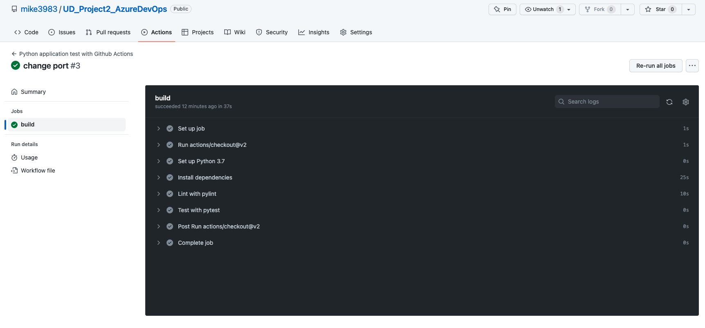
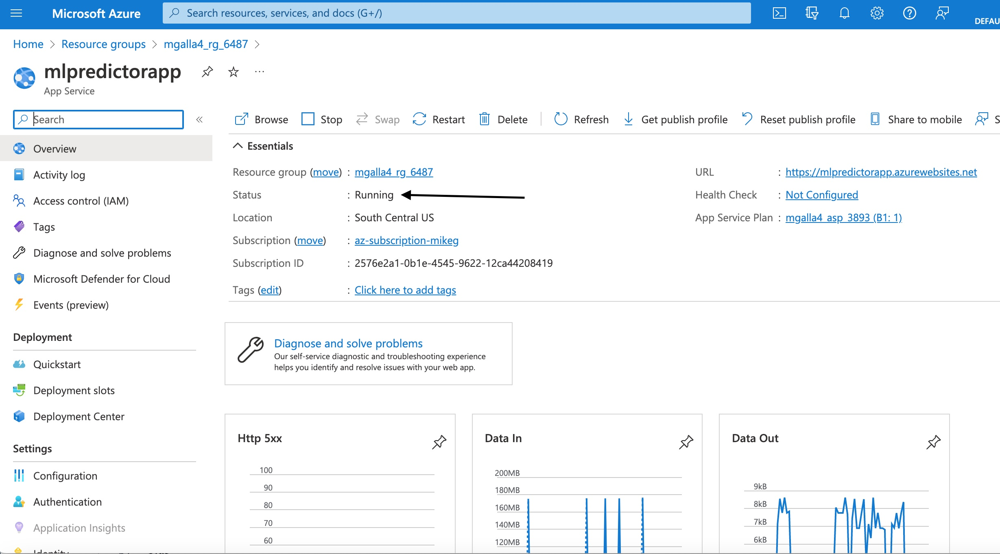
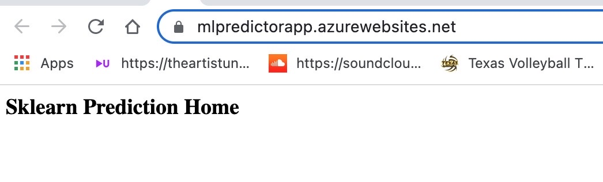
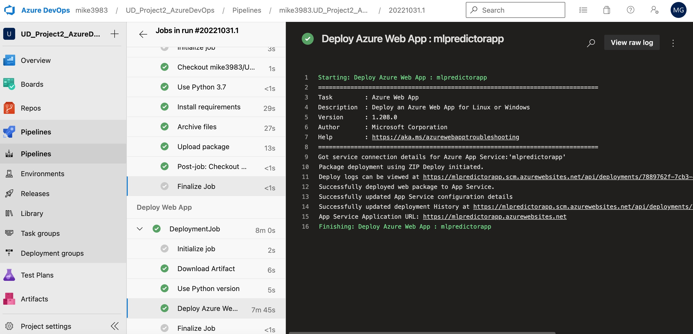
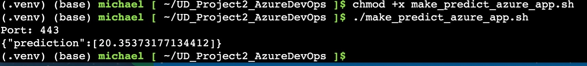

# Overview
This project will detail how to apply Continous Integration (CI) and Continous Delivery (CD) for a Python Machine Learning application using Github Actions and Microsoft Azure Pipelines.

[](https://github.com/mike3983/UD_Project2_AzureDevOps/actions/workflows/main.yml)

## Project Plan

* A link to a [Trello board](https://trello.com/b/YdfJEAQc/machine-learning-app-udacity-project) for the project 
* A link to a spreadsheet that includes the [project plan](https://docs.google.com/spreadsheets/d/1bcAi7Gi0GrflvtWf9zhT2umgKhMSX3n7L9yZFwEQt5c/edit#gid=1348135932)
  
## Architectural Diagram (CI/CD workflow)
<p>

</p>

## Instructions

In MS Azure, launch the Azure Cloud Shell:
<p>

</p>

Once Azure Cloud Shell is running, execute the following commands:

```
git clone https://github.com/mike3983/UD_Project2_AzureDevOps.git
cd UD_Project2_AzureDevOps
```

The output will look like this:
<p>
  
</p>
  
After the repository is available, create a virtual environment:

```
python3 -m venv .venv
source .venv/bin/activate
```
When the virtual environment is activated, install all requirements and execute tests and lint:

```
make all
```

Successful lint and test will yield this:
<p>
  
</p>

Githib Actions can be configured to automatically trigger this command when new code is committed: 
<p>
  
</p>

Now, the Python Flask application can be pushed to Microsoft Azure using this command:
```
az webapp up -n mlpredictorapp --runtime PYTHON:3.7
```
Verify the webapp is running in the Azure Portal:
<p>
  
</p>
<p>
You should be able to visit the URL Azure provides for the webapp, and see the following:
</p>
<p>
  
</p>

We can [configure Continuous Deployment with Azure Pipeline](https://docs.microsoft.com/en-us/azure/devops/pipelines/ecosystems/python-webapp?view=azure-devops#create-an-azure-devops-project-and-connect-to-azure)

Once pipeline is configured, any change in code can be pushed to the webapp in Azure:
<p>
  
</p>

The deployed application can be called and tested using the Azure Cloud Shell:
```
./make_predict_azure_app.sh
```

A successful API call will look like this:
<p>
  
</p>


* Project running on Azure App Service
<p>

</p>

* Project cloned into Azure Cloud Shell
<p>

</p>

* Passing tests that are displayed after running the `make all` command from the `Makefile` and Output of a test run
<p>

</p>

* Successful deploy of the project in Azure Pipelines.  [Note the official documentation should be referred to and double checked as you setup CI/CD](https://docs.microsoft.com/en-us/azure/devops/pipelines/ecosystems/python-webapp?view=azure-devops).

<p>

</p>


* Locust load testing chart
<p>

</p>

* Locust load testing statics
<p>

</p>

## Enhancements

- UI design 
- Pipeline improvement
- ML model upgrade
- 
## Demo 

https://www.youtube.com/watch?v=YmLPBLMCxRQ

